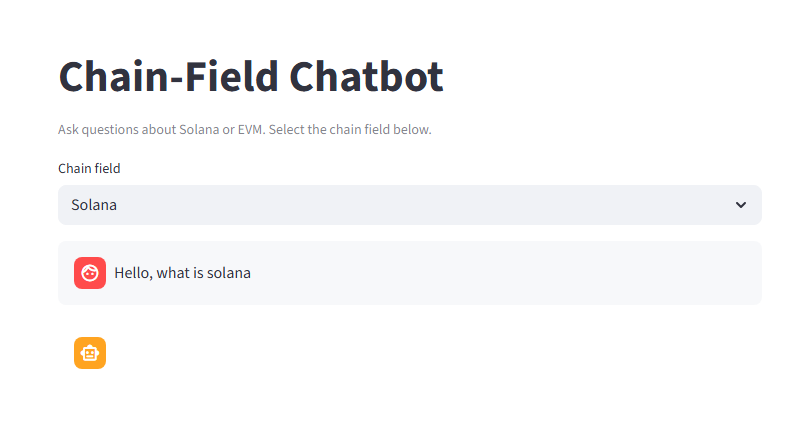

# 💬 Chain-Field Chatbot (Solana + EVM)

A simple chatbot with two selectable **chain fields** (Solana and EVM). You pick a field and chat; answers are grounded in that field's knowledge base via RAG.

---

## 📸 Preview

The app shows a clean UI:

- **🔽 Chain field** – Dropdown to select **Solana** or **EVM**
- **💬 Chat** – Type your question (e.g. "Hello, what is solana"); the bot replies using that chain's docs



---

## ✅ Requirements

- **Python 3.10+** (including 3.14). The app uses FAISS for the vector store (no ChromaDB).

---

## 🚀 Setup

1. **Clone or open the project** and go to the project root.

2. **Create a virtual environment** (recommended):
   ```bash
   python -m venv .venv
   .venv\Scripts\activate   # Windows
   # source .venv/bin/activate  # macOS/Linux
   ```

3. **Install dependencies:**
   ```bash
   pip install -r requirements.txt
   ```

4. **Configure environment:**
   - Copy `.env.example` to `.env`
   - Set `OPENAI_API_KEY` in `.env` (required for embeddings and LLM)

   Example `.env`:
   ```
   OPENAI_API_KEY=sk-...
   LLM_MODEL=gpt-4o-mini
   EMBEDDING_MODEL=text-embedding-3-small
   ```

---

## 📚 Ingest documents (optional but recommended)

- Put Solana-related docs (`.md`, `.txt`, `.pdf`) in `data/solana/`
- Put EVM-related docs in `data/evm/`
- See [data/README.md](data/README.md) for sources (e.g. Solana Cookbook, Ethereum docs)

Then run:

```bash
python -m app.rag.ingest
```

This builds FAISS indexes under `vector_store/solana` and `vector_store/evm`. If you skip this, the app will error on first chat until you run ingest.

---

## ▶️ Run the app

1. **Start the backend** (from project root):
   ```bash
   uvicorn app.main:app --reload --host 0.0.0.0 --port 8000
   ```

2. **Start the frontend** (in another terminal):
   ```bash
   streamlit run frontend/streamlit_app.py
   ```

3. Open the URL shown by Streamlit (e.g. http://localhost:8501). Choose **Solana** or **EVM**, then type your message.

---

## 🔧 Optional: backend URL

If the API runs on another host/port, set:

```bash
set CHATBOT_BACKEND_URL=http://localhost:8000
streamlit run frontend/streamlit_app.py
```

---

## 📁 Project layout

- `app/` – FastAPI app, config, RAG (ingest + chains), Pydantic models
- `app/rag/ingest.py` – Ingest script: `python -m app.rag.ingest`
- `app/rag/chains.py` – RAG retrieval and `get_answer(field, message)`
- `frontend/streamlit_app.py` – Streamlit UI
- `data/solana/`, `data/evm/` – Documents to ingest per field
- `vector_store/` – FAISS index per field (created at runtime; in `.gitignore`)
